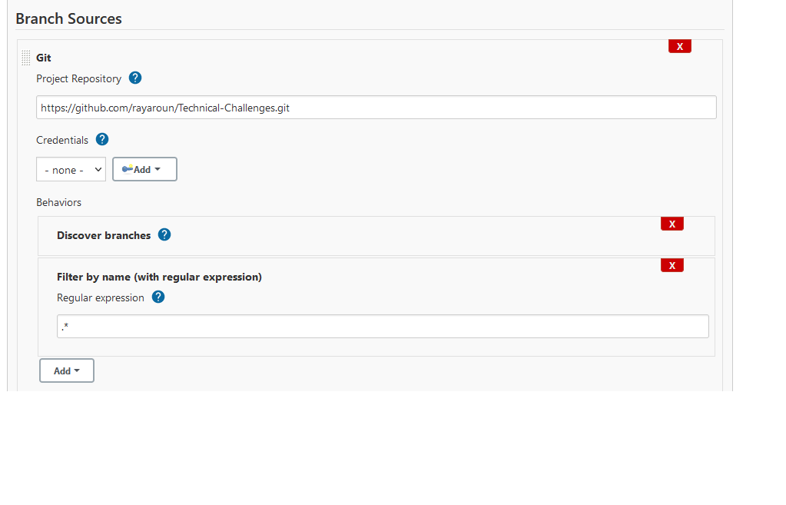
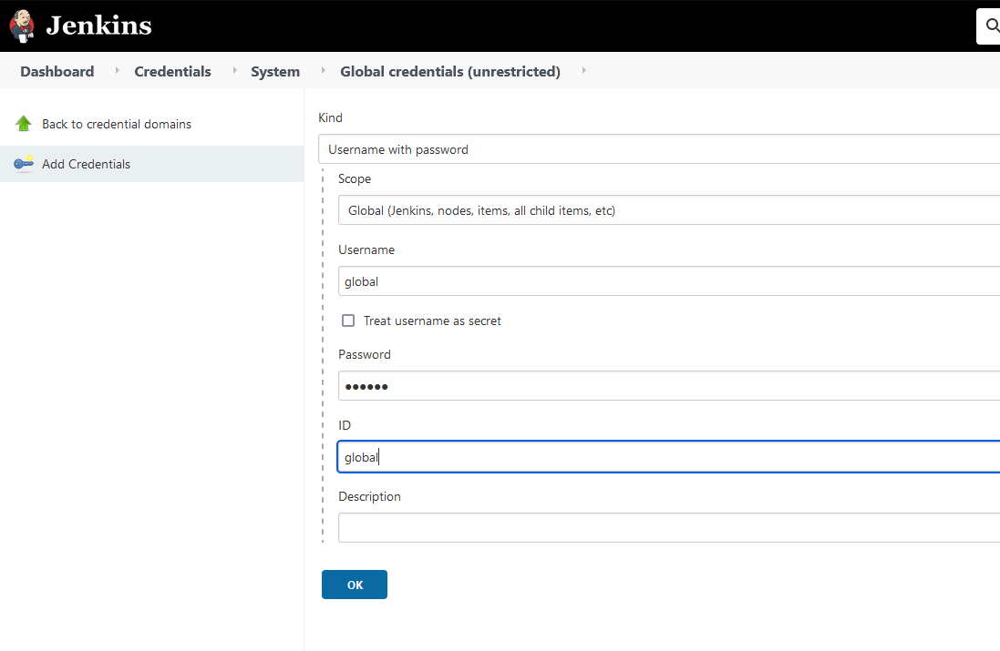
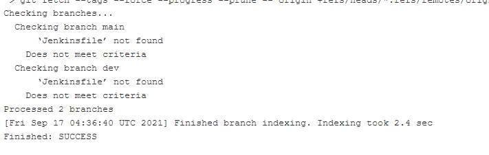
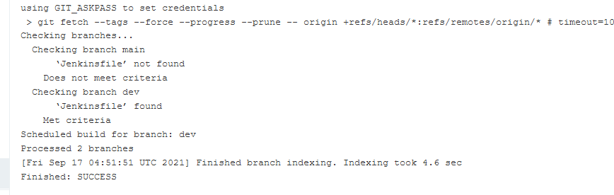
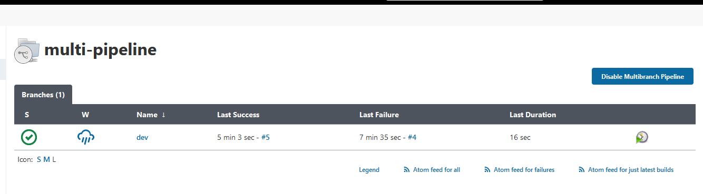
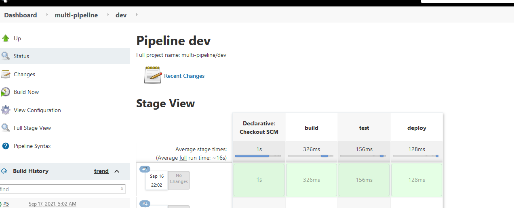
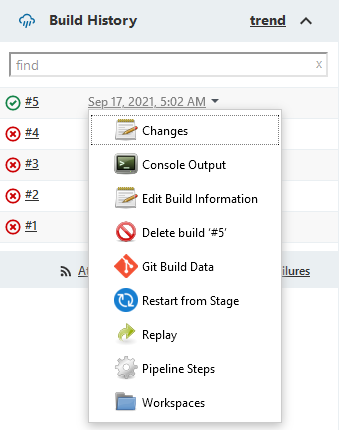

Purpose of the repository - 

1. I'll be using this repository to set up Jenkins from scratch using a docker container. 

2. Consecutively I would be creating a multibranch pipeline with a Git Repository. 

3. Also configure Jenkinsfile

# Part 1: 

To use Jenkins we would obtain the official image fromt the docker hub. 

Here we see that the docker image of jenkins has been deprecated so we use the  jenkins/jenkins:lts image provides by the Jenkins community provided in the deprecation notice. 

So using the command line we launch jenkins. 
We also give various other arguments for : 
1. ports to access through the browser 
2. ports for master/slave communication 
3. running container in the background
4. persisting data of jenkins

Command - 
docker run -p 8080:8080 -p 50000:50000 -d -v Jenkins:/var/jenkins_home jenkins/jenkins:lts

We can see the image is up and running. 

Next, we run the command docker logs with the image name to see if Jenkins Started and to get the key required to initialize it-  
docker logs 5a3893e7d705

Copy the key provided by jenkins to the initial set up.

Open localhost:8080 and enter the key. Select suggested p0lugins or custom plugins. 

The Jenkins plugins would start donwloading upon selecting Recommended plugins. 

Next, Create an admin user. 

Upon finishing setup with the recommended plugins, you are greeted with the following screen.

# Part 2

We would be creating a multi-branch pipeline with Jenkins.

Go to new item. 

Select multibranch pipeline. 

Give name. And in source, select git. Enter a test repository. 

Another thing that you want to give is which branches to discover. 

We are selecting filter by Name (wtih regular expression). This is a regular expression that would get back all the branches

Everything else is okay. Jenkins would use Jenkinsfile for othe configuration and it is set to use Jenkinsfile so we're good. 

Next we need to add credentials. Usually we would have that plugin on the home screen but I'm getting it after selecting the pipeline that I built. 

After selecting your pipeline -> click on credentials on the left -> click on Jenkins (global) -> Click on Global credentials unrestricted 

On the left select "add credentials" 

Create one global credntial like this and another system credential

Now again select your pipeline. Select credential folder add you git hub credentials. 

Now got to the pipline configuration and add the github credentials and save. 

We can see that it scanned the Master and Dev branches for Jenkinsfile.

## Creating a JenkinsFile

Going to the dev branch and creating a Jenkinsfile 

This is a very basic Jenkinsfile 

pipeline {
  
  agent any
  
  stages {
    
    stage("build"){
      
      steps{
      
      }
    }
  }
}

A Jenkinsfile can be written as scripted file or declarative.

In the the file -

pipeline - declares we are building a pipeline

agnet any - build is going to run on any build on the cluster where jenkins is running

stages - is where the pipeline is defined in stage and steps

For our purpose we have written three stages - 

pipeline {
  
  agent any
  
  stages {
    
    stage("build"){
      
      steps{
        
        echo 'building the application'
      
      }
    }
    stage("test"){
      
      steps{
        
        echo 'testing the application'
      
      }
      }
    stage("deploy"){
      
      steps{
        
        echo 'deploying the application'
      
      }
    }
  }
}

  
  
Now we can go back to the pipeline. Select Scan the pipeline now on the left. 

And view the logs. We see it has found the Jenkinsfile in the dev branch. 

If we now go back to the pipline page. We can see Dev branch has been built. Upon selecting that newly created branch we can see the execution at each stage of the branch. 

From the above image we can see. It checksout the code. Then runs that stages build, test, deploy.

Now, if you want to see if some changes that you make would work or not, go to the branch again and click on one of the builds on the left. Click replay from the left option menu. Now we can edit the code and test it if it works or not. 

You can also choose a particular stage to re run. From the dropdown menu besides the builds. 

Finallly, if you want to trigger a jenkins build automatically and not have to select scan again and again. We can install the plugin for the version control system and add the access token to it. 

Thank you.