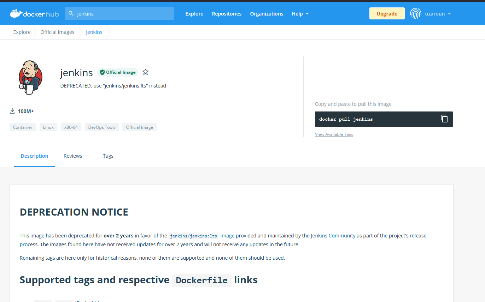

Purpose of the repository - 

1. I'll be using this repository to set up Jenkins from scratch using a docker container. 

2. Consecutively I would be creating a multibranch pipeline with a Git Repository. 

3. Also configure Jenkinsfil

# Part 1: 

To use Jenkins we would obtain the official image fromt the docker hub. 

Here we see that the docker image of jenkins has been deprecated so we use the  jenkins/jenkins:lts image provides by the Jenkins community provided in the deprecation notice. 

So using the command line we launch jenkins. 
We also give various other arguments for : 
1. ports to access through the browser 
2. ports for master/slave communication 
3. running container in the background
4. persisting data of jenkins

Command - 
docker run -p 8080:8080 -p 50000:50000 -d -v Jenkins:/var/jenkins_home jenkins/jenkins:lts

We can see the image is up and running. 

Next, we run the command docker logs with the image name to see if Jenkins Started and to get the key required to initialize it-  
docker logs 5a3893e7d705

Copy the key provided by jenkins to the initial set up.

Open localhost:8080 and enter the key. Select suggested p0lugins or custom plugins. 

The Jenkins plugins would start donwloading upon selecting Recommended plugins. 

Next, Create an admin user. 

Upon finishing setup with the recommended plugins, you are greeted with the following screen.

# Part 2

